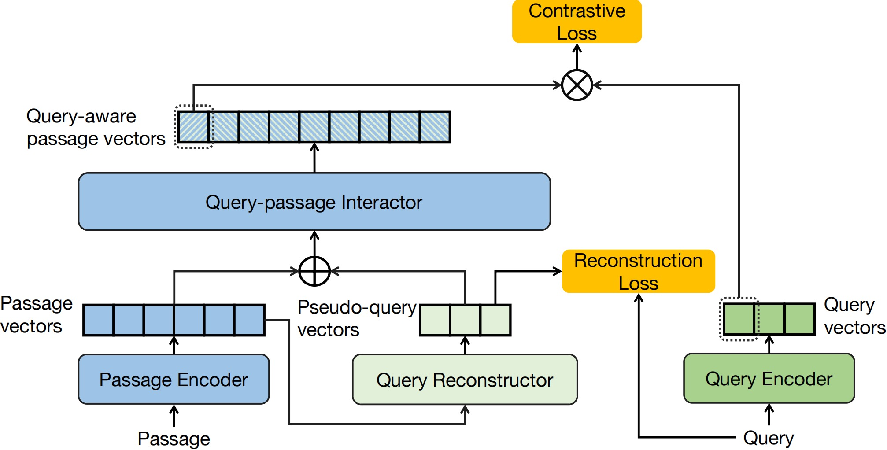

### I<sup>3</sup>Retriever

#### Introduction
Recently, neural retrievers based on pre-trained language models (PLM), such as dual-encoders, have achieved huge success. Yet, studies have found that the performance of dual-encoders are often limited due to the neglecting of the $\textbf{interaction}$ information between queries and candidate passages. Therefore, various interaction paradigms have been proposed to improve the performance of vanilla dual-encoders. Particularly, recent state-of-the-art methods often introduce late-interaction during the model inference process. However, such late-interaction based methods usually bring extensive computation and storage cost on large corpus. Despite their effectiveness, the concern of efficiency and space footprint is still an important factor that limits the application of interaction-based neural retrieval models. To tackle this issue, we $\textbf{I}$ncorporate $\textbf{I}$mplicit $\textbf{I}$nteraction into dual-encoders, and propose $\textbf{I}^3$ retriever. In particular, our implicit interaction paradigm leverages generated pseudo-queries to simulate query-passage interaction, which jointly optimizes with query and passage encoders in an end-to-end manner. It can be fully pre-computed and cached, and its inference process only involves simple dot product operation of the query vector and passage vector, which makes it as efficient as the vanilla dual encoders.

The architecture is depicted in the following figure:
<div align=center></div>
<div align=center>Figure 1: The architecture of our method.</div>

#### Quick Start
##### 1. Install the requirements
```
pip install -r requirements.txt
```
##### 2. Download the data
```
bash script/download_data.sh
```
##### 3. Train the model
```
bash script/train_dual_encoder.sh
```
The finetuned model is available at [here](TODO).


##### 4. Distill the model
```
bash script/train_distill.sh
```
The distilled model is available at [here](TODO).


